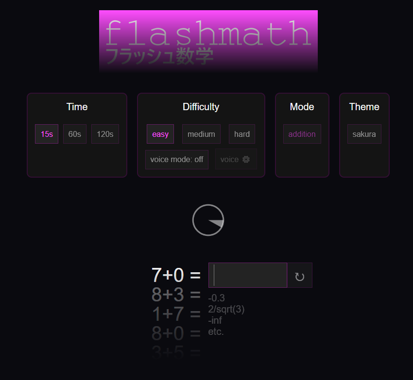

<h1><a id="title" href="https://warpromo.github.io/flashmath/" target="_blank">Flashmath</a></h1>
</img>
<h1><a id="title" href="https://warpromo.github.io/flashmath/" target="_blank">https://warpromo.github.io/flashmath/</a></h1>
<h1>In flashmath, you practice your mental math.</h1> 
<h1>There are many things to customize, such as different modes, flash anzan, and even a voice-mode.</h1> 
<h1><b>Made using HTML + Javascript + CSS</b></h1>
